# Real Estate Auction Analytics Agent - Sequence Diagram

## Complete User Query to Analysis Flow

```mermaid
sequenceDiagram
    participant User
    participant ChatInterface as React ChatInterface
    participant AuthContext as Auth Context
    participant Backend as FastAPI Backend
    participant AnalyticsService as Analytics Service
    participant MongoDB as MongoDB Database
    participant OpenAI as OpenAI GPT-4 API
    participant ChartRenderer as Chart Renderer

    Note over User, ChartRenderer: User Query Processing Flow

    %% User Input Phase
    User->>ChatInterface: Types query: "Compare institutional vs individual investors"
    ChatInterface->>ChatInterface: Validate input (non-empty, length)
    ChatInterface->>ChatInterface: Update UI state (loading: true)
    ChatInterface->>AuthContext: Get current user context
    AuthContext-->>ChatInterface: Returns user_id: "demo_user"

    %% API Request Phase
    ChatInterface->>Backend: POST /api/chat
    Note right of ChatInterface: ChatQuery{<br/>message: "Compare institutional...",<br/>user_id: "demo_user"<br/>}

    Backend->>Backend: Receive request at chat_query() endpoint
    Backend->>Backend: Log: "Processing query: Compare institutional..."
    Backend->>AnalyticsService: Call analyze_query(user_query)

    %% Context Gathering Phase
    AnalyticsService->>AnalyticsService: Call get_database_context()
    AnalyticsService->>MongoDB: Query users collection
    MongoDB-->>AnalyticsService: Returns 17 investors
    AnalyticsService->>MongoDB: Query properties collection  
    MongoDB-->>AnalyticsService: Returns 15 properties
    AnalyticsService->>MongoDB: Query auctions collection
    MongoDB-->>AnalyticsService: Returns 15 auctions
    AnalyticsService->>MongoDB: Query bids collection
    MongoDB-->>AnalyticsService: Returns 33 bids

    %% Data Analysis Phase
    AnalyticsService->>AnalyticsService: Analyze investor types
    Note right of AnalyticsService: institutional: 4<br/>individual_hnw: 6<br/>international: 2<br/>flippers: 5
    
    AnalyticsService->>AnalyticsService: Calculate market segments
    Note right of AnalyticsService: luxury: 4 properties<br/>mid_market: 8 properties<br/>affordable: 3 properties
    
    AnalyticsService->>AnalyticsService: Compute geographic markets
    Note right of AnalyticsService: NY: avg $8.5M<br/>Beverly Hills: avg $9.8M<br/>Palo Alto: avg $3.6M
    
    AnalyticsService->>AnalyticsService: Generate auction activity metrics
    Note right of AnalyticsService: total_volume: $45.8M<br/>avg_competition: 18.2 bids<br/>success_rate: 87.5%

    %% AI Processing Phase
    AnalyticsService->>AnalyticsService: Build enhanced system prompt
    Note right of AnalyticsService: Include:<br/>- Market Overview<br/>- Investor Ecosystem<br/>- Auction Activity<br/>- Top Markets

    AnalyticsService->>OpenAI: POST /v1/chat/completions
    Note right of AnalyticsService: {<br/>model: "gpt-4",<br/>messages: [system_prompt, user_query],<br/>temperature: 0.7<br/>}

    OpenAI->>OpenAI: Process natural language query
    OpenAI->>OpenAI: Apply market intelligence
    OpenAI->>OpenAI: Determine chart type: "bar"
    OpenAI->>OpenAI: Generate chart data
    OpenAI->>OpenAI: Create summary insights
    
    OpenAI-->>AnalyticsService: Return JSON response
    Note left of OpenAI: {<br/>"response": "Professional analysis...",<br/>"chart_type": "bar",<br/>"chart_data": {...},<br/>"summary_points": [...]<br/>}

    %% Response Processing Phase
    AnalyticsService->>AnalyticsService: Parse JSON response
    AnalyticsService->>AnalyticsService: Validate chart_data format
    AnalyticsService->>AnalyticsService: Create ChatResponse object

    %% Database Storage Phase
    AnalyticsService->>MongoDB: Insert chat_messages
    Note right of AnalyticsService: Store query history:<br/>user_id, message, response,<br/>chart_data, chart_type,<br/>summary_points, timestamp
    MongoDB-->>AnalyticsService: Confirm storage

    %% Return Response Phase
    AnalyticsService-->>Backend: Return ChatResponse
    Backend->>Backend: Log: "Generated response with chart type: bar"
    Backend-->>ChatInterface: HTTP 200 + ChatResponse JSON

    %% Frontend Rendering Phase
    ChatInterface->>ChatInterface: Update state (loading: false)
    ChatInterface->>ChatInterface: Add user message to messages array
    ChatInterface->>ChatInterface: Add bot response to messages array
    ChatInterface->>ChatInterface: Scroll to bottom (messagesEndRef)

    %% Message Rendering
    ChatInterface->>ChatInterface: Render ChatMessage component
    Note right of ChatInterface: User message in blue bubble<br/>Bot message in gray bubble<br/>Timestamp display

    %% Summary Points Rendering
    ChatInterface->>ChatInterface: Render summary points section
    Note right of ChatInterface: Blue background container<br/>"Key Insights:" header<br/>Bullet points with insights

    %% Chart Rendering Phase
    ChatInterface->>ChartRenderer: Pass chart_data and chart_type
    ChartRenderer->>ChartRenderer: Determine chart type: "bar"
    ChartRenderer->>ChartRenderer: Format data for Recharts
    ChartRenderer->>ChartRenderer: Create ResponsiveContainer
    ChartRenderer->>ChartRenderer: Configure BarChart properties
    Note right of ChartRenderer: CartesianGrid, XAxis, YAxis<br/>Tooltip, Legend, Colors<br/>Data series mapping

    ChartRenderer->>ChartRenderer: Render interactive bar chart
    ChartRenderer-->>ChatInterface: Chart component mounted

    %% Final User Experience
    ChatInterface-->>User: Display complete response
    Note left of User: ✅ Professional analysis text<br/>✅ Key insights bullets<br/>✅ Interactive bar chart<br/>✅ Ready for next query

    %% Error Handling Paths (Alternative Flows)
    alt OpenAI API Failure
        OpenAI-->>AnalyticsService: Error response
        AnalyticsService->>AnalyticsService: Call generate_fallback_response()
        AnalyticsService->>AnalyticsService: Use predefined chart data
        AnalyticsService-->>Backend: Return fallback ChatResponse
    end

    alt Database Connection Issues
        MongoDB-->>AnalyticsService: Connection timeout
        AnalyticsService->>AnalyticsService: Use empty context {}
        AnalyticsService->>AnalyticsService: Continue with OpenAI call
    end

    alt JSON Parsing Error
        AnalyticsService->>AnalyticsService: JSON parse fails
        AnalyticsService->>AnalyticsService: Log error and use fallback
        AnalyticsService-->>Backend: Return error ChatResponse
    end
```



## Detailed Component Interactions

### 1. **Frontend Layer Interactions**

```
User Input → ChatInterface State Management → API Communication
├── Input validation and sanitization
├── Loading state management  
├── Authentication context retrieval
├── HTTP request formation
└── Response handling and UI updates
```

### 2. **Backend API Layer**

```
HTTP Request → FastAPI Routing → Service Layer → Response Formation
├── /api/chat endpoint processing
├── Request validation with Pydantic
├── Analytics service delegation
├── Error handling and logging
└── JSON response serialization
```

### 3. **Analytics Service Intelligence**

```
Query Analysis → Context Gathering → AI Processing → Response Synthesis
├── Database context aggregation
├── Market intelligence computation
├── OpenAI prompt engineering
├── Response parsing and validation
└── Fallback handling
```

### 4. **Database Operations**

```
Multi-Collection Queries → Data Aggregation → Market Analysis
├── users: investor classification
├── properties: market segmentation
├── auctions: activity metrics
├── bids: competition analysis
└── chat_messages: history storage
```

### 5. **AI Processing Pipeline**

```
Natural Language → Market Intelligence → Visualization Logic → Professional Response
├── Intent recognition and entity extraction
├── Market context application
├── Chart type determination
├── Data synthesis for visualization
└── Actionable insight generation
```

### 6. **Visualization Rendering**

```
Chart Data → Component Processing → Interactive Rendering
├── Data format validation
├── Chart type selection (bar, line, pie, etc.)
├── Recharts configuration
├── Responsive design application
└── Interactive features (tooltips, legends)
```

## Performance Metrics

| Component | Typical Response Time | Error Handling |
|-----------|----------------------|----------------|
| User Input Validation | <50ms | Client-side validation |
| Backend API Processing | 100-200ms | Try-catch with logging |
| Database Context Gathering | 200-500ms | Connection timeout handling |
| OpenAI API Call | 3-8 seconds | Fallback responses |
| Response Processing | 50-100ms | JSON parsing error recovery |
| Frontend Rendering | 100-300ms | Component error boundaries |
| Chart Rendering | 200-500ms | Data validation and defaults |

## Error Recovery Paths

### 1. **OpenAI API Failures**
- Network timeouts → Use cached/fallback responses
- Rate limiting → Queue requests with retry logic
- Invalid responses → Generate default chart data

### 2. **Database Issues**
- Connection failures → Continue with empty context
- Query timeouts → Use basic market metrics
- Data corruption → Validate and sanitize results

### 3. **Frontend Errors**
- Component failures → Error boundaries with retry
- Network issues → Show offline indicators
- Rendering problems → Fallback to text-only responses

## Scalability Considerations

### 1. **Concurrent User Support**
- Async processing throughout the pipeline
- Connection pooling for database operations
- Rate limiting for OpenAI API calls

### 2. **Caching Strategies**
- Database context caching (Redis potential)
- OpenAI response caching for common queries
- Frontend component memoization

### 3. **Monitoring & Analytics**
- Request/response logging at each layer
- Performance metrics collection
- User interaction analytics
- Error rate monitoring

This sequence diagram illustrates the complete flow from user input to rendered analytics, showcasing the sophisticated AI agent architecture that powers the real estate auction analytics platform.