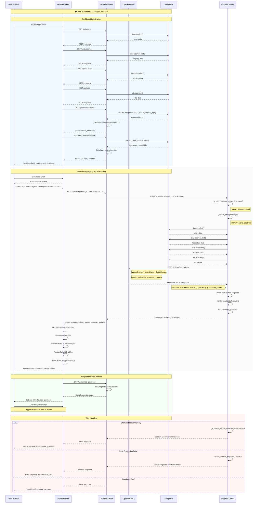

# Real Estate Auction Analytics - Sequence Diagram

## Complete Data Flow and Logic Architecture

## Key Components Breakdown

### 🎯 **Analytics Service (AS) - Core Logic Engine**
- **Intent Detection**: Analyzes user queries to determine analysis type
- **Domain Validation**: Ensures queries are real estate auction related
- **Data Aggregation**: Combines data from multiple DB collections
- **LLM Orchestration**: Manages OpenAI API calls with context

### 🤖 **OpenAI LLM Integration**
- **Model**: GPT-4 with function calling capability
- **Input**: System prompt + user query + aggregated data context
- **Output**: Structured JSON with multiple charts, tables, and insights
- **Function Calling**: Used for structured response formatting

### 🗄️ **MongoDB Collections**
- **users**: Investor/user profiles
- **properties**: Real estate property data
- **auctions**: Auction events with status tracking
- **bids**: Bid history with timestamps and amounts

### 🔄 **Data Processing Pipeline**
1. **Query Reception**: User input received via React frontend
2. **Intent Analysis**: Backend determines query type and relevance
3. **Data Aggregation**: Multiple DB collections queried in parallel
4. **LLM Enhancement**: OpenAI processes data with natural language context
5. **Response Structuring**: Multiple charts and tables generated
6. **Frontend Rendering**: React components display interactive visualizations

### 📊 **Chart & Table Rendering**
- **Charts**: Recharts library with ResponsiveContainer (320px height)
- **Layout**: 2-column grid for charts, full-width for tables
- **Interactivity**: Sorting, pagination, CSV download for tables
- **Loading States**: Progress bars and skeleton placeholders

### 🔧 **API Endpoints Overview**
- `GET /api/users` - All registered investors
- `GET /api/properties` - Available auction properties  
- `GET /api/auctions` - Auction events and status
- `GET /api/bids` - Bidding history and amounts
- `GET /api/investors/active` - Active investors (6 months)
- `GET /api/investors/inactive` - Inactive investors
- `GET /api/sample-questions` - Predefined query examples
- `POST /api/chat` - Main analytics query endpoint

### ⚡ **Performance Optimizations**
- **Parallel API Calls**: Dashboard metrics fetched simultaneously
- **Database Indexing**: Efficient queries on timestamp and status fields
- **Response Caching**: LLM responses structured for quick rendering
- **Lazy Loading**: Components render progressively

### 🛡️ **Error Handling Strategy**
- **Domain Validation**: Filters non-real estate queries
- **Fallback Responses**: Manual charts when LLM fails
- **Graceful Degradation**: Basic functionality maintained during errors
- **User Feedback**: Clear error messages and loading states